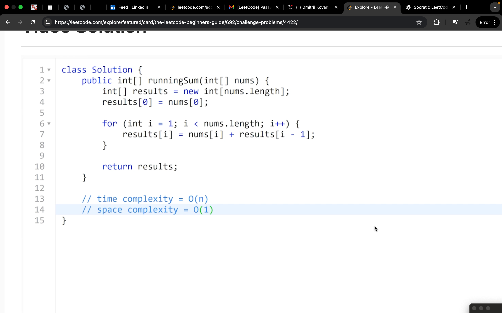

# LeetCode for Spreadsheet Lovers 🧮

**Think of LeetCode as Excel formulas, but for programming interviews!**

If you're comfortable with spreadsheets and want to learn algorithmic problem-solving, this repository bridges that gap. We'll show you how LeetCode problems are just like building complex Excel formulas - but instead of `=SUM(A1:A10)`, you're writing code that does the same thing.

## 🎯 What You'll Learn

- How to think about algorithms like spreadsheet formulas
- Converting LeetCode problems into familiar CSV/table formats
- Understanding complexity (like knowing when your Excel sheet will be slow)
- Writing optimal solutions with mathematical proof

## 📊 Example: Running Sum Problem

### The Problem (Like a Spreadsheet Task)

**Question**: Given a list of numbers, create a new list where each number is the sum of all previous numbers plus itself.

**In Excel terms**: If you have `[1,2,3,4]` in cells A1:A4, you want B1:B4 to show `[1,3,6,10]` where:
- B1 = A1 (just the first number)
- B2 = A1 + A2 = 1 + 2 = 3
- B3 = A1 + A2 + A3 = 1 + 2 + 3 = 6
- B4 = A1 + A2 + A3 + A4 = 1 + 2 + 3 + 4 = 10


*Visual representation of the Running Sum problem - see how each element builds upon the previous sum, just like cumulative formulas in Excel!*

### The Solution (Java Code)

```java
class Solution {
    public int[] runningSum(int[] nums) {
        // Step 1: Initialize (i=1) - nums[0] already correct as base case
        // Invariant: nums[0] = sum(original_nums[0..0])
        
        // Step 2-4: Iterate from i=1 to n-1 with in-place accumulation
        // Invariant maintained: ∀j<i: nums[j] = Σ(original_nums[0..j])
        for (int i = 1; i < nums.length; i++) {
            // Step 3: Accumulate - nums[i] = nums[i-1] + nums[i]
            // Necessity: Cannot skip this operation without breaking running sum property
            // Optimality: In-place update achieves O(1) auxiliary space
            nums[i] += nums[i-1];
            
            // Step 4: Increment handled by for loop
            // Ensures termination and progression through array
        }
        
        // Step 5: Return modified nums array
        // Post-condition: ∀i: nums[i] = Σ(original_nums[0..i])
        // Space optimal: Returns original array reference
        return nums;
    }
}
```

### How This Relates to Spreadsheets

| Step | What It Does | Excel Equivalent | Why It's Optimal |
|------|-------------|------------------|------------------|
| 1 | Keep first number as-is | `=A1` | Base case - no calculation needed |
| 2 | For each remaining cell... | Loop through A2:A4 | Must process each cell once |
| 3 | Add previous sum to current | `=B1+A2`, `=B2+A3`, etc. | Each cell depends on the one before |
| 4 | Store result in same position | Overwrite original data | Saves memory (like Excel's "in-place" calculation) |

### Complexity Analysis (Like Excel Performance)

- **Time**: O(n) - We visit each cell exactly once (like Excel calculating a formula)
- **Space**: O(1) - We don't create a new array (like Excel not needing extra columns)
- **Optimal**: This is the fastest possible solution - you can't do better!

## 🛠️ Tools in This Repository

### System Prompts (Your "Excel Templates")

- **`csv-leetcode-system-prompt.md`** - Converts LeetCode problems into CSV format (like exporting Excel data)
- **`higher-order-logic-system-prompt.md`** - Advanced mathematical approach (like Excel's solver with constraints)

### Example Files

- **`leetcode-sample-question-1drunningsum.md`** - The complete problem statement
- **`leetcode-java-solution.java`** - The optimized solution with formal verification
- **`Leetcode-CSV-Solution (Exponent Labs LLC) - leetcode-question-sample-solution-claude.csv`** - Problem broken down into spreadsheet-like steps

## 🚀 Getting Started

1. **Read the problem** like you'd read an Excel requirement
2. **Think in terms of formulas** - what calculation do you need?
3. **Consider efficiency** - like knowing when your Excel sheet will be slow
4. **Write the code** - like writing a complex Excel formula
5. **Verify correctness** - like checking your Excel calculations

## 💡 Key Insights for Spreadsheet Users

- **Arrays = Columns**: `nums[0], nums[1], nums[2]` is like `A1, A2, A3`
- **Loops = Fill Down**: `for (int i = 1; i < n; i++)` is like dragging a formula down
- **Variables = Cell References**: `nums[i-1]` is like referencing the cell above
- **Optimization = Efficient Formulas**: Just like avoiding `=SUM(A1:A1000)` when you could use `=A99+A1000`

## 🎓 Next Steps: How to Solve Any LeetCode Problem

### Step 1: Understand the Problem (Like Reading Excel Requirements)
1. **Read the problem statement** - What's the input? What's the expected output?
2. **Work through examples by hand** - Like testing a formula on sample data
3. **Identify the pattern** - What calculation or transformation is needed?

### Step 2: Think in Spreadsheet Terms
1. **Map the data structure**:
   - Arrays → Excel columns (A1, A2, A3...)
   - 2D arrays → Excel tables (A1:C3)
   - Strings → Text in cells
2. **Identify the operation**:
   - Summing → `=SUM()` function
   - Finding max/min → `=MAX()` or `=MIN()`
   - Counting → `=COUNTIF()`
   - Sorting → Excel's sort feature

### Step 3: Plan Your Algorithm (Like Designing a Formula)
1. **Break it into steps** - What would you do in Excel?
2. **Consider edge cases** - What if the data is empty? What if there's only one cell?
3. **Think about efficiency** - Will this be slow on large datasets?

### Step 4: Write the Code (Like Writing a Complex Formula)
1. **Start with the basic structure**:
   ```java
   // Like setting up your Excel columns
   for (int i = 0; i < nums.length; i++) {
       // Your calculation here
   }
   ```
2. **Handle edge cases first** - Like checking if your Excel range is empty
3. **Test with examples** - Like verifying your formula works on sample data

### Step 5: Optimize (Like Making Your Excel Sheet Faster)
1. **Check time complexity** - How many operations? (Like counting formula calculations)
2. **Check space complexity** - How much memory? (Like how many extra columns you need)
3. **Look for improvements** - Can you do this in fewer steps?

### Step 6: Practice Problems to Try Next

**Easy Problems (Like Basic Excel Formulas)**:
- [Two Sum](https://leetcode.com/problems/two-sum/) - Like finding two cells that add up to a target
- [Valid Parentheses](https://leetcode.com/problems/valid-parentheses/) - Like checking if your Excel formulas are balanced
- [Maximum Subarray](https://leetcode.com/problems/maximum-subarray/) - Like finding the best consecutive range to sum

**Medium Problems (Like Complex Excel Functions)**:
- [Longest Substring Without Repeating Characters](https://leetcode.com/problems/longest-substring-without-repeating-characters/) - Like finding the longest unique sequence
- [3Sum](https://leetcode.com/problems/3sum/) - Like finding three cells that sum to zero
- [Product of Array Except Self](https://leetcode.com/problems/product-of-array-except-self/) - Like calculating products while excluding each cell

### Step 7: Use the Tools in This Repository
1. **Try the CSV approach** - Use `csv-leetcode-system-prompt.md` to break down problems
2. **Apply formal verification** - Use `higher-order-logic-system-prompt.md` for optimization
3. **Study the examples** - Look at how the Running Sum problem was solved

### Pro Tips for Spreadsheet Users
- **Start simple**: Don't try to optimize immediately - get it working first
- **Use examples**: Always work through the given examples by hand
- **Think step-by-step**: Like building a complex Excel formula piece by piece
- **Practice regularly**: Like getting better at Excel shortcuts

Remember: **Every LeetCode problem is just a complex Excel formula waiting to be written!** 🧮✨

## 📝 About Us

This repository was created to bridge the gap between spreadsheet expertise and algorithmic problem-solving. We believe that if you can master Excel formulas, you can master LeetCode problems - they're just different ways of expressing the same logical thinking.

### Our Mission
To make algorithmic problem-solving accessible to spreadsheet users by:
- Providing clear analogies between Excel operations and programming concepts
- Offering step-by-step guides that build on existing spreadsheet knowledge
- Creating tools that convert complex algorithms into familiar table formats
- Demonstrating that optimization principles apply to both spreadsheets and code

### Contributing
We welcome contributions! Whether you're:
- A spreadsheet expert who wants to learn programming
- A programmer who wants to help explain concepts in spreadsheet terms
- Someone with ideas for new problems or better explanations

Feel free to:
- Open issues for new problems or improvements
- Submit pull requests with solutions or documentation
- Share your own spreadsheet-to-code analogies

### License
This project is licensed under the MIT License - see the [LICENSE](LICENSE) file for details.

### Acknowledgments
- Inspired by the countless spreadsheet users who want to transition into programming
- Built on the foundation of formal verification and optimization theory
- Thanks to the LeetCode community for providing excellent problem sets

---

**Made with ❤️ for spreadsheet lovers who want to conquer LeetCode!**
